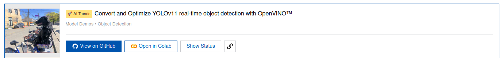
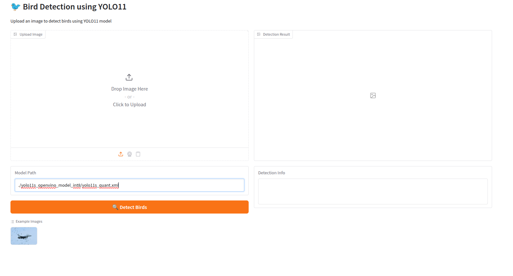
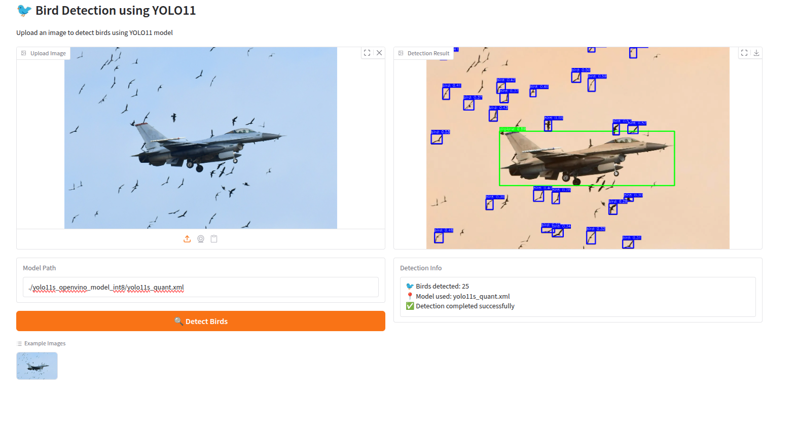
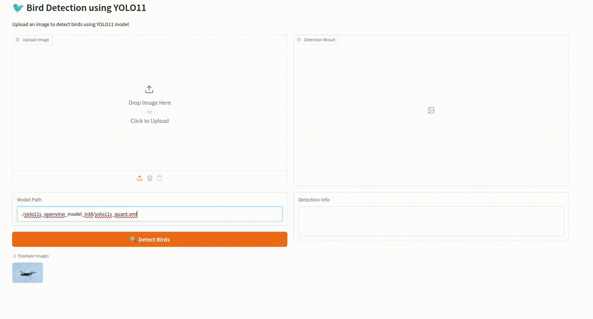

# [활주로 조류 난입 감지 앱]

[Intel] 엣지 AI SW 아카데미 13기: OpenVINO Mini Project - [Object Detection]
활주로에 난입한 새를 감지하는 프로젝트입니다.

## 프로젝트 목적

### 문제 정의

공항 활주로로 새가 날아들어온 것을 인지하지 않고 비행기를 주행했을 때 ‘버드 스트라이크’ 문제가 발생할 위험이 있습니다.

### 해결 방안

촬영한 이미지를 업로드하면 이미지에 새가 찍혔을 경우 이를 출력으로 알리는 앱을 만들었습니다.

## 팀 구성

- 이은서: 팀장, PM, README 작성
- 김민정: 코드 모듈화, 모델 양자화, 프레젠테이션
- 이종희: 코드 병합, 기능 구현

## 원본 예제

**[Convert and Optimize YOLOv11 real-time object detection with OpenVINO™]**


[https://openvinotoolkit.github.io/openvino_notebooks/?search=Convert+and+Optimize+YOLOv11+real-time+object+detection+with+OpenVINO™](https://openvinotoolkit.github.io/openvino_notebooks/?search=Convert+and+Optimize+YOLOv11+real-time+object+detection+with+OpenVINO%E2%84%A2)

---

## 프로젝트 구조

```
openvino-mini-project_bird-detection/
├── bird_dataset/
├── bird_detect/
│   └── bird_fear.py
├── yolov11_pipeline/
│   ├── __init__.py
│   ├── core.py
│   ├── data_utils.py
│   ├── model_utils.py
│   └── quantization.py
├── app.py
├── inference.py
├── make_model.py
├── notebook_utils.py
├── README.md
└── requirements.txt
```

## 구성

본 프로젝트는 Gradio 앱으로 실행합니다.


### 주요 패키지

- **OpenVINO**: 모델 변환 및 추론
- **Ultralytics**: YOLOv11 모델 로드
- **OpenCV**: 이미지 처리
- **NumPy:** 배열 연산
- **Gradio**: 앱 인터페이스 형성

## 실행

### 설치

1. 본 레포지토리를 설치하기 위해 터미널에서 아래 명령어를 실행합니다.
    
    ```bash
    git clone https://github.com/LES4975/openvino-mini-project_bird-detection.git
    ```
    
2. 터미널에서 경로를 clone한 프로젝트 디렉토리로 설정하고, 아래 명령어를 실행합니다.
    
    ```bash
    pip install -r requirements.txt
    python app.py
    ```
    
    `app.py`를 실행하면 Gradio 앱이 브라우저를 통해 실행됩니다.
    

### Gradio 앱



‘Upload Image’란에 이미지 파일을 업로드 혹은 붙여넣기하거나 카메라를 연결할 수 있습니다.

앱 하단의 ‘Example Images’에는 샘플 이미지가 들어있습니다.

이미지를 업로드한 후, ‘Detect Birds’ 버튼을 클릭하면, 수 초 후 감지 결과를 우측 섹션에서 확인할 수 있습니다.



이러한 간단한 동작으로 이미지로부터 새를 감지할 수 있습니다.
(▼ 실 사용 동작)
